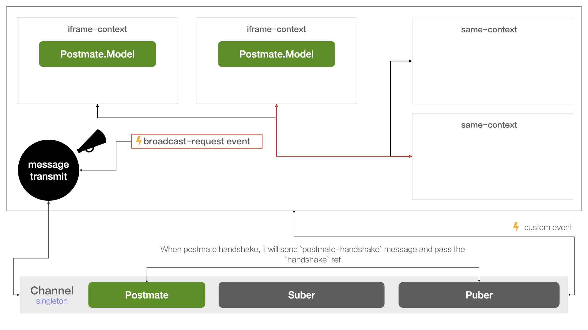

### About

> Isomorphic channel for Micro Frontends.

### Feature



* 🤝 Support `Cross-Context` communications.
* 📢 Support `broadcast-mode`.
* 🚀 Support handler binding to `iframe`, No Restrictions(structured clone).

### install

**step 1: install**

```shell
$ npm install
```

### Core Api

#### setup

> If you need `broadcast-mode`, must call `setup` first.

```javascript
import { channel } from '@ennew/one-portal-channel';
channel.setup()
```

#### on

> listen from `channel`, return a `cancellation`

```javascript
import { channel } from '@ennew/one-portal-channel';

const remove = channel.on('iframe-broadcast', (payload) => {
  alert(`in qiankun: ${JSON.stringify(payload)}`)

  // remove listener
  remove()
})
```

⚠️ **listen to iframe context**

> To break the `structured clone algorithm` limitation，We provide `cb.autoRun`, you need to use it to wrap your handler.

```javascript
import { channel, cb } from '@ennew/one-portal-channel';

// The magic of cb.autoRun
// 1. It will break the limitation of [structured clone algorithm]
// 2. Transform handler to current context.
channel.on('qiankun-broadcast', cb.autoRun((payload) => {
  alert(`in iframe: ${JSON.stringify(payload)}`)
}))
```

#### broadcast

> broadcast to `channel`


```javascript
import { channel } from '@ennew/one-portal-channel';

setTimeout(() => {
  channel.broadcast('qiankun-broadcast', { key: 'hello, I am qianku.' })
}, 5000)
```

#### send

> send to `channel`, without `broadcast-mode`

```javascript
import { channel } from '@ennew/one-portal-channel';

channel.send(message, payload);
```

### Enable Debug Mode

```javascript
import { channel } from '@ennew/one-portal-channel';

channel.debug();
```

### handshake with iframe

#### handshake

> see https://github.com/dollarshaveclub/postmate


```javascript
const disconnect = channel.handshake({
  container: DOM_NODE,
  url: IFRAME_URL,
  name: NAME, // required
  classListArray: [], // your own classList
});

// disconnect
disconnect();
```
